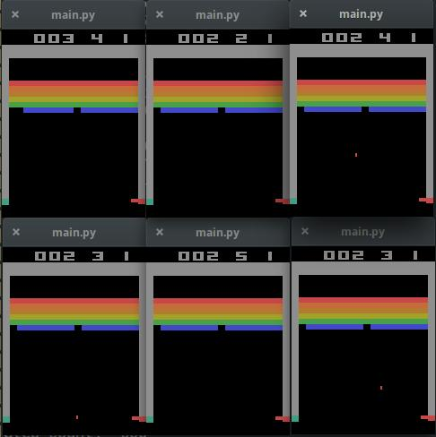

# Asynchronous Method for Deep Reinforcement Learning

Google DeepMind's Paper: [Asynchronous Method for Deep Reinforcement Learning](http://proceedings.mlr.press/v48/mniha16.pdf).

This implementation contains:

1. Deep Q-network and Q-learning
2. Varying epsilon for improving exploration vs exploitation
    - to reduce the correlations between consecutive updates
3. Network for Q-learning targets are fixed for intervals
    - to reduce the correlations between target and predicted Q-values
4. Separate actor-learner threads
    - To improve system performance

## Requirements

- Python 2.7 or Python 3.3+
- [gym 0.7.0](https://github.com/openai/gym)
- [tqdm](https://github.com/tqdm/tqdm)
- [SciPy](http://www.scipy.org/install.html) or [OpenCV2](http://opencv.org/)
- [TensorFlow 1.3.0](https://github.com/tensorflow/tensorflow/tree/r1.3)
- [Atari-py 0.0.21](https://github.com/openai/atari-py)

## Usage

First, install prerequisites with:

    $ pip install tqdm gym[all]
    $ pip install atari-py==0.0.21
    $ pip install gym==0.7.0

To train a model for Breakout:

    $ python main.py --env_name=Breakout-v0 --is_train=True
    $ python main.py --env_name=Breakout-v0 --is_train=True --display=True

To test and record the screen with gym:

    $ python main.py --is_train=False
    $ python main.py --is_train=False --display=True

## References

- [simple_dqn](https://github.com/tambetm/simple_dqn.git)
- [Code for Human-level control through deep reinforcement learning](https://sites.google.com/a/deepmind.com/dqn/)

## License

MIT License.
